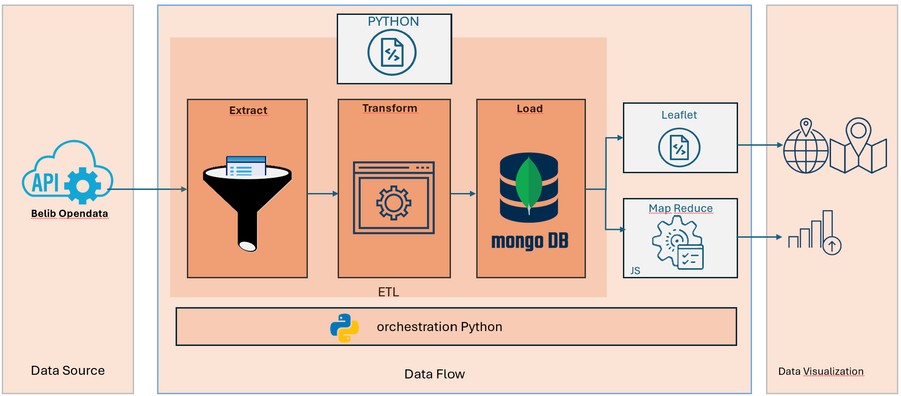
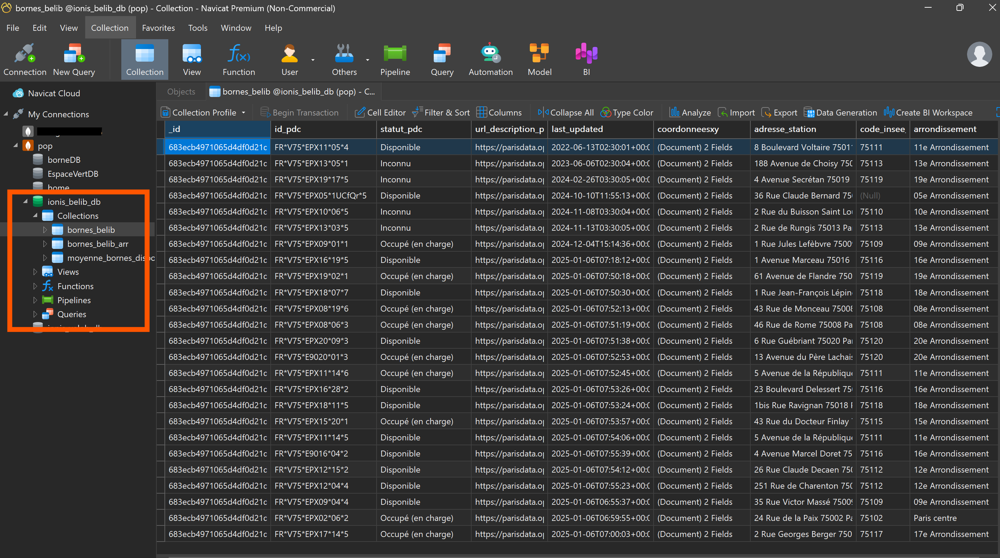
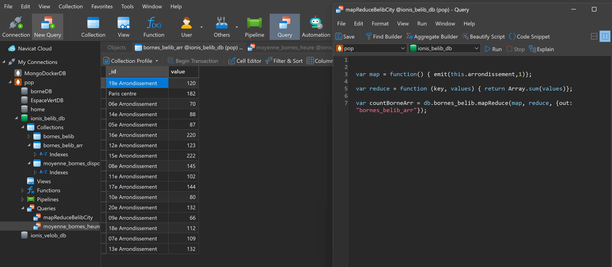
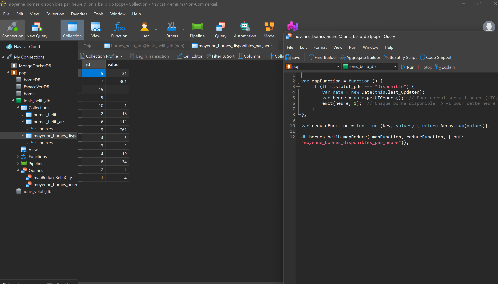

# ArchiHadoop
Analyse des données de points de recharge pour vehicules electriques disponibilite temps reel.

# BELIB : DEVELOPPEMENT D'UN PIPELINE DATA AVEC PYTHON+MONGODB+LEAFLET+MAPREDUCE 

Ce projet permettra de maîtriser un pipeline ETL/ELT moderne avec des technologies Big Data (NoSQL, Hadoop) et une visualisation interactive.

Belib sont des données géolocalisées de disponibilité en temps réel des Points de recharge de voiture électrique.

## 1. Liste de pièces-jointes
- répertoire `etl`
    - `run.py`
    - `config.py`
    - `extract.py`
    - `load.py`
- `api.py`
- `leaflet.py`
- répertoire `data`
- ce fichier `Readme.md`
- Le fichier `image.png`
- Le fichier `belib_log.png` (image du popup des marqueurs de la carte)

## 2. Application/outil utilisés

Outil/Apps 	---->	Rôle

Python 	----> Langage principal pour le pipeline ETL et la logique globale.
PyCharm ----> IDE pour coder, tester, et organiser les fichiers Python.
MongoDB Community ----> Interface graphique pour explorer les données MongoDB.
Navigateur Web ----> Pour tester l'affichage Leaflet et l'API si exposée.

## 3. Dataset 
[BELIB](https://opendata.paris.fr/explore/dataset/belib-points-de-recharge-pour-vehicules-electriques-disponibilite-temps-reel/information/?disjunctive.statut_pdc&disjunctive.arrondissement&sort=code_insee_commune&dataChart=eyJxdWVyaWVzIjpbeyJjaGFydHMiOlt7InR5cGUiOiJjb2x1bW4iLCJmdW5jIjoiQ09VTlQiLCJzY2llbnRpZmljRGlzcGxheSI6dHJ1ZSwiY29sb3IiOiIjRkZDRDAwIn1dLCJ4QXhpcyI6Imxhc3RfdXBkYXRlZCIsIm1heHBvaW50cyI6IiIsInRpbWVzY2FsZSI6ImhvdXIiLCJzb3J0IjoiIiwiY29uZmlnIjp7ImRhdGFzZXQiOiJiZWxpYi1wb2ludHMtZGUtcmVjaGFyZ2UtcG91ci12ZWhpY3VsZXMtZWxlY3RyaXF1ZXMtZGlzcG9uaWJpbGl0ZS10ZW1wcy1yZWVsIiwib3B0aW9ucyI6eyJkaXNqdW5jdGl2ZS5zdGF0dXRfcGRjIjp0cnVlLCJkaXNqdW5jdGl2ZS5hcnJvbmRpc3NlbWVudCI6dHJ1ZSwic29ydCI6ImNvZGVfaW5zZWVfY29tbXVuZSJ9fX1dLCJkaXNwbGF5TGVnZW5kIjp0cnVlLCJhbGlnbk1vbnRoIjp0cnVlfQ%3D%3D&basemap=jawg.dark&location=12,48.85989,2.33457)

## 4. Objectif

• 	Pipeline ETL: Récupérer les données via une API Open Data,
		          Nettoyer les données
•	MongoDB :     Stocker les données dans MongoDB,
•	MapReduce :   Calculer le nombre de bornes disponibles par arrondissement
        	      Trouver la moyenne des bornes disponibles par heure.
•	Leaflet :     Afficher la carte interactive avec un marqueur coloré (vert/rouge) selon disponibilité à 500m à proximité de l’adresse saisie.

## 5. Architecture (cf. image.png)
- Outils ETL/ELT :  Orchestration Python
- Bases de données : MongoDB
- MapReduce : JavaScript

## 5. Resultat (ordre d'exécution)
Lancement du pipeline : python run_etl.py
Lancement de l'API : python api.py
Ouverture leaflet_map/index.html dans le navigateur

